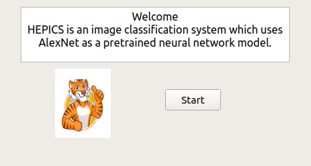
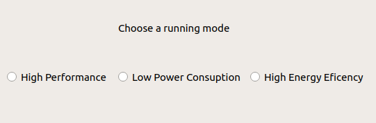

# Introduction #
This project consists in building an image classification system, which takes images as input and gives a prediction -in percentages- of what would be on these given images. For instance, the system may receive an image of a human face as input, after treating the data, the output is then represented in a small list of objects that may be on the picture, ordered by their probability percentages. In this case, the system should display a list, whose first element "human face" is, next to the probability which the system calculated for this result.

The motivation behind this project is artificial neural networks. These are computing systems which were inspired by the biological neural network of an animal. Such systems gain knowledge in executing tasks -in our case image recognition- through a certain training. For an image recognition neural network to correctly perform its task, it is required to analyze examples of images that have been manually labeled. Other uses where artificial neural networks are deployed are predictions, function approximations, or real life patterns recognition...

Nowadays, machine learning is gaining in importance as the goal of including machines in various activities -industries, services, economy- in order to reach high levels of efficiency is in need of artificial intelligence. Indeed, under the applications of artificial neural networks, we can mention autonomous driving, natural language processing, gesture recognition, and of course, face recognition, which is the main application of this project.

It must not be forgotten to mention as well, that there exists different neural networks models, such as Back-Propagation, Boltzman Machines and Deep Neural Networks, with which we will deal in this project. In particular, we will deal with "AlexNet", which is a convolutional neural network consisting of 8 layers, 5 of which are convolutional while the others are fully-connected layers.

On one hand, deploying deep neural networks not only means unlocking a massive parallelism potential for our system, but it also means that unsupervised learning is most definitely possible. On the other, we are in need of a huge data set for this unsupervised training. It is important to mention as well, that deep neural networks require intense computations, which manifests itself in high power consumption and learning and classification time.

For the sake of decreasing the number of disadvantages of deep neural networks, the decision of using heterogeneous platforms such as CPUs, GPUs and FPGAs was made. These will provide the system with a good performance for a wide range of computations, as well as a decent usage of pipelines and parallelism, and of course, all with low power consumption.

To take a taste at the fascinating world of machine learning and artificial neural networks, we invite you to try out our image recognition system, and maybe even have a little fun with it.

# Target specifications #

## Must-requirements ##

* The system must be able to classify images.
* The system must allow the selection of one or more input images.
* The system must show the result of the treatment.
* The system must employ artificial neural networks.
* The system must deploy the AlexNet deep neural network.
* The system must know at least one set of weights.
* The system must be able to execute intense calculations through heterogeneous platforms (CPU, GPU, FPGA, ASIC).
* The system must support an FPGA through OpenCL.
* The system must hide the OpenCL details behind an abstraction layer.
* The system must offer three performance profiles : 
    - High Performance
    - Low Power
    - Energy Efficency
* The system must allow the control and the execution of commands through a GUI interface.
* The system must be able to run the GUI on an Ubuntu system.
* The system must exhibit a classification interface.
* The system must be able to measure its performance.
* The system must be able to measure its power consumption.
* The system communicate with another system. It looks into a file to search for an image treatment request, and send back the results via Ethernet connection.
* The system must include the aggregate feature. This feature fuses the results of different treatments of the same object in order to reach more precision.
* The system must offer the possibility of entering up to 5 images in the aggregate feature.

## Can-Requirements ##

* The system can offer the possibility of entering more than 5 images in the aggregate feature.
* The system can deploy a GPU.
* The system can deploy a DSP.
* The system can deploy the GoogleNet neural network next to AlexNet. 
* The system can allow the training of neural networks.
* The system can display the topology of the neural network.
* The system can write the results into a file in order to use it for another program.
* The system can run batch processing.
* The system can carry out transfer learning of the already implemented neural network.
* The system can beautify the output result.
* The system can generate weight files.
* The system can load different weight files.
* The system can pause, resume or cancel the classification process.

## Criteria of demarcation ##
* The system cannot be a real-time application.
* The system cannot run on mobile-plattforms.

# Product Use #
 
## Field of application ##
This program is designed for image classification. The user or system can use this program to recognize pre-specified or learned objects. Because the system runs on heterogeneous platforms, the user is allowed to switch between various operation modes depending on power or performance preferences.
Victims of strokes or memory problems have a hard time recognizing even the most simple objects we deal with everyday. Building on this system, it would be possible to help these people to rebuild their memories or label the objects presented on the images. It can also help the visually disabled have a better idea about their environment through processing images they choose.
Another application of this system is the optimization of the traffic lights through equipping them with a functionality that would set the traffic free for other sides, if the current side is empty.
We can think about a use in the tourism field as well, as tourists may want to have a better idea about buildings or statues of the city they are visiting, which they can do through our system.
 
## Target Group ##
* people with impaired vision
* tourists
* developers of other systems
* users who need to classify images
* systems which process images or solve problem in computer vision

 
## Operation Condition ##
The following conditions must be met:

* Hardware and software as follows must be available: 
    - Host PC with Ubuntu 16.04
    - FPGA
* System and possible user-system must be installed.
* Images must be accessible to file system.
* Host PC must be powered.
* FPGA must be powered.
* Images must be JPG.
* FPGA have to be connected to Host PC.
* There must be enough storage for the program.
* There must be enough storage to store results. 

# Product Environment #
 
## Software ##
* Ubuntu 16.04 - operating system of Host PC
* QT - to create classic and embedded GUI
* OpenCL - framework for writing programs that execute across heterogeneous platforms
 
## Hardware ##
* Lab PC at CDNC institute
* FPGA

# Product Functions #
## Basic Functions ##

* /F010/ show welcome screen
* /F020/ show start menu
* /F030/ choose input image (at least 5 images of an object at various angels)
* /F040/ reset the selection
* /F050/ choose operation mode: High Performance, Low Power Consumption, High Energy Efficiency
* /F060/ start processing
* /F070/ pause processing
* /F080/ stop processing
* /F090/ show output results (names and precents of top 5)
* /F100/ terminate program

## Optional Functions ##

* /F110/ choose neural network type
* /F120/ deploy training of an arbitraty neural network
* /F130/ transfer learning of the already implemented neural network
* /F140/ show neural network topology
* /F150/ show output results in clear form (with histogram or pie chart)

# Product-Data #
## System-Data ##

 * /D10/classification with percent bars

## User-Data ##
 
* /D20/ For classification the original image and the result must be kept.
* /D30/ The following user-data should be saved: /LD10/ 
    * Image that the user uploads
* /D40/ If a user uploads more than one image, all images will be saved.

# Systemmodell #
.jpg)

* Programming with less complexity makes delightful code that is less buggy and easier to maintain because it is reusable without modification. In order to achieve this goal we use in this context the MVC architecture wich consists of:

## Modell ##
* The model represents the data, and does nothing else. The model does NOT depend on the controller or the view. It contains the pretrained neural network model AlexNet as well as the classification algorithm to be used on images.

## View ##
* The view displays the model data, and sends user actions (e.g. button clicks) to the controller. It represents the graphical user ineterface wich interacts with the user (See Graphical User Interface)

## Controller ##
* The controller provides model data to the view, and interprets user actions such as button clicks. The controller depends on the view and the model.

# Product Performance #
* To start the program, the user must click start-button.
* User must choose the operation mode with one click.
* The user does not need to press more than three buttons to upload an image.
* While classifying an image one percent of the time required must be visible to the user .
* No real time requirements.

# Graphical User Interface #
## Introduction ##
* The GUI, which represents the front-end, is the communication channel between the user and the back-end. It will guide users through the variety of operations which can be performed by the System.

## Start-Window ##
* After program start a welcome window, with informations on the Software, will be displayed.(See figure x.xx)

## Choose-Operation-Window ##
* After clicking on Start-button in the start-window, another window will pop up. The user will have to chose a running mode:
* 1- High Performance
* 2- Low Power Consumption
* 3- High Energy Efficiency
and browse to the image path
* See figure (x.xx)

## Browsing-Window ##
* The browser window allows a user to specify his input image.

## Error-Window ##
* If the operation mode or the input data was not specified an error is shown to notify the user. Here we can create two windows for each error See figure (x.xx)

# Quality Specification #
* The acceleration hardware should accelerate or save power consumption.
* The test coverage should be as high as possible.
* Maintenance and reusability results from the implementation in the MVC principle.
* Robustness plays a crucial role in the development, so that arbitrary keystrokes do not lead to a crash.

# Testfälle und Testszenarien #

# Entwicklungsumgebung #
* Altera SDK
* Eclipse
* Git
* Latex
* Markdown
* Ubuntu
* Gcov

# Glossar #

* Neuronale Netze
* Alex Net 
* FPGA GUI
* GPU
* DSP
* Google Net
* Beschleunigungshardware
* High Performance
* Low Power
* Energy Efficency
* Ubuntu
* QT
* Workstation
* Echtzeitanwendung
* Moblile Plattformen

